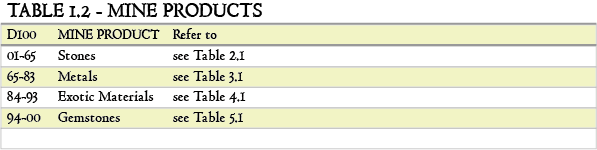
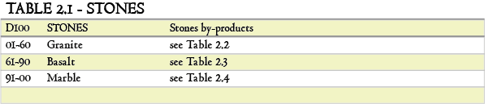
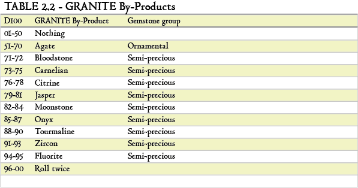
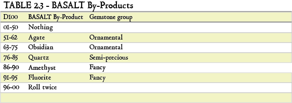
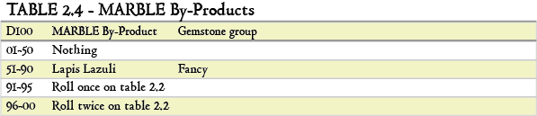
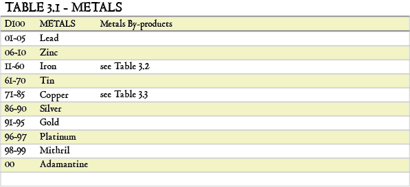
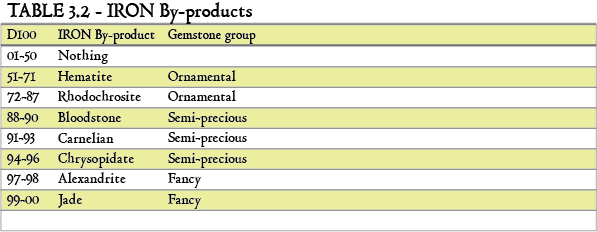
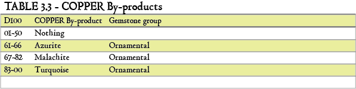
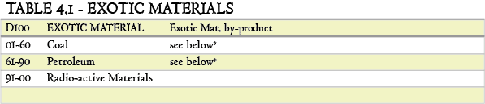
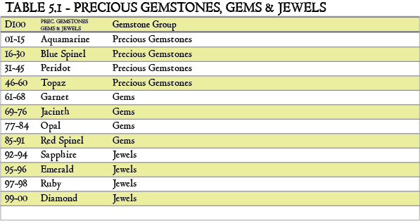

## Mining + Gemcutting

TODO:
1. Add mining outposts?
2. Add smithing?
3. Add improving weapons with magic gemstones?

### Mining

Per 4h minen [str modifier] keer rollen

### Gemcutting:
D20 + mod to see what happens:
0-8: gem breaks
9-19: improve worth ([d100]%)
20+: improve worth \*2 ([d100]%)

#### Modifiers

Time taken:
	
	0-1h: + 0
	1-4h: + 1
	4h+: +2

Skill level:
	
	Journeyman: + 1
	Level up: 20? stones, 20h studying
	Expert: + 2
	Level up: 100? stones, find artisan and train 100h
	Artisan: + 3
	Level up: cut 300? stones, perform quest for Master
	Master: + 4

Stone weight (based on mining tables):

	Type			Count	Cost
	Ornamental		1		1gp
	Semi precious 	2		10gp
	Fancy			4		20gp
	Precious		8		50gp
	Gems			16		100gp
	Jewels			32		500gp
